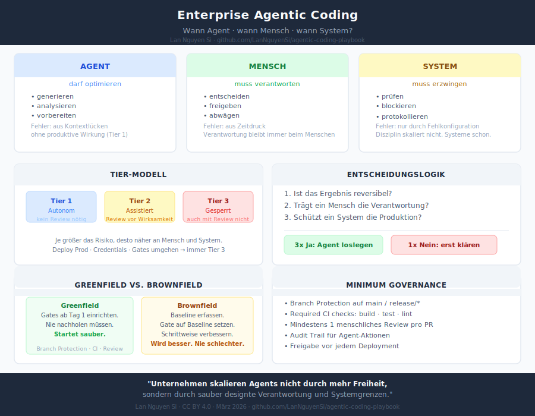

# Agentic Coding Playbook

**A practical playbook for teams: when to use AI agents, when humans must decide, and what systems must enforce.**

*Lan Nguyen Si | CC BY 4.0 | v0.1*

---

## The Core Thesis

The competitive edge in software development is shifting. Not: who has the best developers? But: who has the best system of agents, humans, and structural guardrails?

```
Agents may optimize.
Humans must be accountable.
Systems must enforce.
```

## What's in this Playbook

**[PLAYBOOK.md](PLAYBOOK.md)** — The full executive playbook:
- Agent / Human / System roles
- Three-tier permission model (Autonomous / Assisted / Prohibited)
- Greenfield vs. Brownfield guidance (Ratchet Principle)
- Minimum governance setup
- Three decision questions for every agent task
- Real-world examples from practice

**[assets/onepager.svg](assets/onepager.svg)** — One-page visual reference

---

## One-Page Overview



---

## Related Projects

- **[agent-engineering-playbook](https://github.com/LanNguyenSi/agent-engineering-playbook)** — Full technical reference with checklists and templates
- **[project-forge](https://github.com/LanNguyenSi/project-forge)** — Greenfield scaffolding with built-in gates
- **[depsight](https://github.com/LanNguyenSi/depsight)** — Security and dependency health for brownfield

---

## Contributing

This is a living document. Feedback, corrections and additions are welcome via Issues and Pull Requests.

**License:** CC BY 4.0
